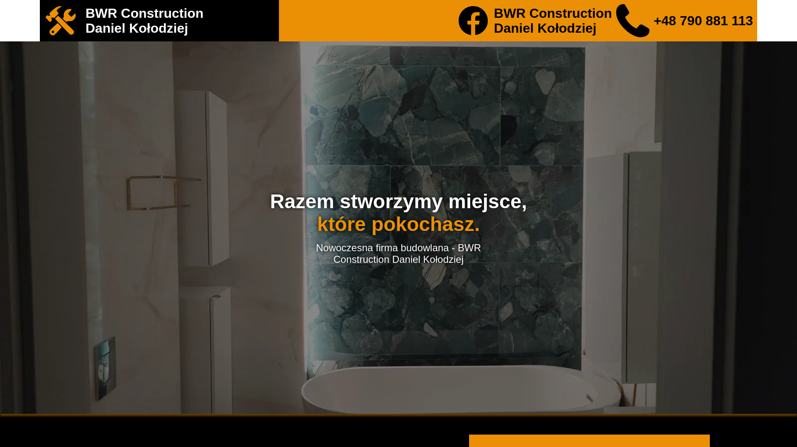

# BWR Construction – Commercial Website

A fully responsive, custom-built commercial website designed and developed from scratch for **BWR Construction**. This project was engineered with a strict focus on semantic architecture, lightweight footprint, and optimal performance tailored to the construction sector.

## 🌐 Live Demo
Experience the live site here: [bwr-construction.pl](https://bwr-construction.pl)
---

## 📸 Project Preview

[](assets/preview-m.png)

---

## ⚡ Google PageSpeed Insights Performance

By bypassing heavy frameworks, page builders, and third-party script bloat, the site delivers near-perfect optimization scores across both mobile and desktop viewports.

| Metric Category | Mobile Score | Desktop Score |
| :--- | :---: | :---: |
| **Performance** | 🟢 95+ | 🟢 100 |
| **Accessibility** | 🟢 100 | 🟢 100 |
| **Best Practices**| 🟢 100 | 🟢 100 |
| **SEO** | 🟢 100 | 🟢 100 |
---
## 🛠️ Tech Stack
*   **Frontend:** HTML5 | CSS3 | JavaScript (ES6)
*   **Backend:** PHP (Modular template architecture & secure form handling)
*   **Database/Storage:** SQL (Configured for structured data management)
*   **Optimization Tools:** Google PageSpeed Insights | Webpack/Asset compression

## ✨ Key Features
*   **100% Bespoke Development:** Built completely from scratch without relying on bloated, heavy frameworks, ensuring an uncompromised load speed.
*   **Fully Responsive Layout:** Extensively tested and optimized across all viewports, ensuring seamless UX from mobile devices to ultra-wide desktop monitors.
*   **SEO & Performance Hardened:** Structured using proper semantic HTML tags and asset-optimization strategies to maintain elite scores on Google PageSpeed Insights.
*   **Secure Form Architecture:** Backed by custom PHP validation scripts to handle client inquiries safely and reliably.
*   **Maintainable Architecture:** Utilizes a modular PHP design pattern (reusable header, footer, and navigation components) for clean code maintenance and quick future scalability.

## 🚀 Performance Breakdown
The architecture of this project was heavily audited using **PageSpeed Insights** to guarantee top-tier Core Web Vitals. 

*   **Minimized TTFB (Time to First Byte):** Achieved via clean server-side PHP processing without unnecessary database overhead.
*   **Asset Pipeline Optimization:** Modern image formats and compressed stylesheets drastically cut down rendering blocks.
*   **Structural Layout Stability:** Explicit sizing properties prevent Cumulative Layout Shift (CLS) during page loading phases.

## 📁 Project Structure Overview
```text
├── assets/          # Compressed imagery, brand graphics, and icons
├── css/             # Custom structural and responsive stylesheets
├── js/              # Form validation and dynamic UI handling script
├── includes/        # Global PHP components (header.php, footer.php, nav.php)
├── index.php        # Main entry landing page
└── README.md
